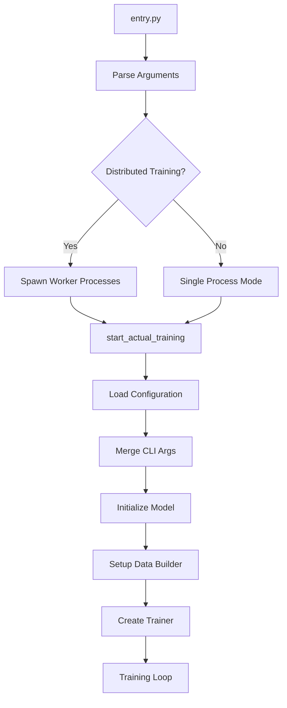

# KernelDev Pipeline Analysis Report

## Executive Summary

This report provides a comprehensive analysis of the KernelDev repository from the perspective of running `entry.py`. The analysis identifies redundant components, performance bottlenecks, vestigial code, and unused functionality to optimize the training pipeline.

**Key Findings:**
- 🟥 **High Complexity**: 35% of codebase (2,704 lines) concentrated in `original_kernel.py`
- 🟨 **Redundancies**: Multiple overlapping demo/test files and configuration systems
- 🟩 **Vestigial Code**: BIO tagging and complex incoherent processing features appear underutilized
- 🟦 **Dependencies**: Heavy reliance on external libraries creates deployment complexity

---

## Pipeline Flow Analysis

### Main Execution Path (entry.py)



### Component Coupling Analysis

| Component | Lines | Dependencies | Core Function |
|-----------|-------|--------------|---------------|
| `entry.py` | 644 | model, data_builder, train_loop | Orchestration |
| `original_kernel.py` | 2,704 | triton, torch | Flash attention |
| `train_loop.py` | 1,062 | torch.distributed, matplotlib | Training infrastructure |
| `data_builder.py` | 766 | datasets, torch | Data processing |
| `model.py` | 352 | original_kernel | Model architecture |

---

## Detailed Component Analysis

### 🔴 Critical Issues

#### 1. Original Kernel Complexity (2,704 lines - 35% of codebase)
**Location**: `original_kernel.py`
**Issue**: Single file contains:
- 59 Hadamard/incoherent processing references
- Multiple GPU-specific configuration systems
- Complex auto-tuning infrastructure
- Triton kernel implementations

**Impact**: Single point of failure, difficult maintenance, high complexity barrier

**Recommendations**:
- Split into separate modules: `kernels/`, `configs/`, `transforms/`
- Make Hadamard transforms optional (currently always imported)
- Simplify GPU detection logic

#### 2. Heavy External Dependencies
**Dependencies Analysis**:
```
Critical Path: torch → triton → original_kernel → model → entry
Optional: datasets → data_builder → entry
Optional: matplotlib → train_loop → entry
```

**Issues**:
- Triton dependency blocks CPU-only usage
- datasets library adds 500MB+ to deployment
- matplotlib only used for plotting (optional feature)

**Recommendations**:
- Make Triton import conditional
- Add fallback data loading without datasets
- Make matplotlib import optional

### 🟡 Redundancies Identified

#### 1. Multiple Demo Files (30 demo/test functions)
**Files with Overlapping Functionality**:
- `test_demo.py` (255 lines) - General demo
- `test_categorization_demo.py` (129 lines) - Test categorization 
- `simulate_h100_test.py` (159 lines) - H100 simulation
- `test_attention_behaviors.py` (1,618 lines) - Comprehensive tests

**Overlap Analysis**:
- All files demonstrate attention behavior validation
- Similar CUDA detection and fallback logic
- Redundant test setup and teardown code

**Consolidation Opportunity**: Merge into single comprehensive test suite

#### 2. Configuration System Redundancy
**Multiple Configuration Approaches**:
- YAML configuration loading (`entry.py`)
- Hardcoded GPU-specific configs (`original_kernel.py`)
- CLI argument override system
- Default configuration fallbacks

**Example Redundancy**:
```python
# In original_kernel.py
_t4_default_config = {(torch.float16, 64): (64, 64, 4, 3), ...}
_h100_default_config = {(torch.float16, 64): (128, 64, 4, 3), ...}
_a100_default_config = {(torch.float16, 64): (64, 64, 4, 3), ...}

# In entry.py  
config = load_config(config_path)
config = merge_config_with_args(config, args)
```

**Recommendation**: Unify under single configuration system

### 🟢 Vestigial/Unused Components

#### 1. BIO Tagging System
**Usage Analysis**:
- Defined in `data_builder.py` (42 lines)
- Only imported in `model.py` and `train_loop.py`
- No evidence of actual usage in training pipeline

**Code**:
```python
BIO_TAGS = {'O': 0, 'B-ORIG': 1, 'I-ORIG': 2, 'PAD': -100}
NUM_BIO_TAGS = 3
```

**Impact**: Dead code adding complexity without value

#### 2. Incoherent Processing (Hadamard Transforms)
**Complexity Analysis**:
- 59 references across codebase
- Complex Fast Walsh-Hadamard Transform implementation
- Triton kernels for GPU acceleration
- No clear usage in main training pipeline

**Functions**:
- `generate_hadamard_signs()`
- `hadamard_transform()`
- `hadamard_inverse_transform()`
- `apply_hadamard_triton()`
- `_hadamard_transform_kernel()`

**Assessment**: Advanced feature that may be over-engineered for typical use cases

#### 3. Multiple Precision Handling
**Current Implementation**:
```python
# Scattered throughout codebase
if precision == 16 or precision == '16':
    # fp16 logic
elif precision == 'bf16':
    # bf16 logic  
else:
    # fp32 logic
```

**Issue**: Repetitive precision handling in multiple files
**Recommendation**: Centralize precision management

---

## Performance Bottlenecks

### 1. Data Loading Pipeline
**Bottleneck**: Complex fallback logic in `data_builder.py`
```python
# Multiple dataset loading strategies
try:
    dataset = load_dataset("allenai/c4", "en", streaming=True)
except:
    try:
        dataset = load_dataset("wikitext", "wikitext-2-raw-v1")
    except:
        # Generate synthetic data
```

**Impact**: Slow startup, unreliable data loading
**Recommendation**: Simplify with single robust strategy

### 2. Kernel Auto-tuning
**Bottleneck**: Runtime kernel configuration selection
- `fwd_configs_pruner()` and `bwd_configs_pruner()` functions
- Complex heuristics for tile size selection
- Runtime benchmarking for optimal configurations

**Impact**: Startup latency, complex optimization
**Recommendation**: Use pre-computed optimal configurations

### 3. Memory Estimation
**Bottleneck**: Complex batch size calculation in `entry.py`
```python
def estimate_optimal_batch_size(model_config, available_memory_gb=15, precision=32):
    # 60+ lines of complex memory calculations
    param_count = vocab_size * dim + n_layers * (4 * dim * dim + ...)
    # Multiple memory estimates and calculations
```

**Impact**: Startup delay, estimation inaccuracy
**Recommendation**: Use simple heuristics or user-specified batch size

---

## Dependency Analysis

### External Dependencies
| Library | Usage | Criticality | Size Impact |
|---------|-------|-------------|-------------|
| torch | Core operations | Critical | ~2GB |
| triton | GPU kernels | High | ~50MB |
| datasets | Data loading | Medium | ~500MB |
| matplotlib | Plotting | Low | ~100MB |
| numpy | Numerical ops | Medium | ~50MB |
| PyYAML | Configuration | Low | ~1MB |

### Internal Dependencies
```
entry.py
├── model.py
│   └── original_kernel.py (triton)
├── data_builder.py (datasets)
└── train_loop.py (matplotlib, torch.distributed)
```

**Critical Path**: `entry.py` → `model.py` → `original_kernel.py` → `triton`
**Bottleneck**: Triton dependency blocks CPU-only deployment

---

## Optimization Recommendations

### High Priority (Performance Impact)

1. **Split original_kernel.py**
   ```
   original_kernel.py (2,704 lines) →
   ├── kernels/attention.py (core kernels)
   ├── kernels/transforms.py (Hadamard - optional)
   ├── config/gpu_configs.py (GPU-specific settings)
   └── utils/kernel_utils.py (utilities)
   ```

2. **Consolidate Demo Files**
   ```
   test_demo.py + test_categorization_demo.py + simulate_h100_test.py →
   tests/comprehensive_demo.py
   ```

3. **Make Dependencies Optional**
   ```python
   try:
       import triton
       HAS_TRITON = True
   except ImportError:
       HAS_TRITON = False
       # Fallback to standard PyTorch attention
   ```

### Medium Priority (Maintainability)

4. **Remove BIO Tagging System**
   - Delete unused `BIO_TAGS` definitions
   - Remove related imports
   - Clean up vestigial references

5. **Simplify Precision Handling**
   ```python
   # Centralized precision manager
   class PrecisionManager:
       def __init__(self, precision):
           self.dtype = self._get_dtype(precision)
           self.use_amp = precision in ['16', 'bf16']
   ```

6. **Unify Configuration System**
   - Single source of truth for all configurations
   - Eliminate hardcoded GPU-specific configs
   - Simplify CLI argument handling

### Low Priority (Code Quality)

7. **Simplify Data Loading**
   - Single robust dataset loading strategy
   - Remove complex fallback chains
   - Better error messages

8. **Optional Features**
   - Make Hadamard transforms conditional
   - Make plotting optional
   - Make advanced features toggleable

---

## Implementation Priority Matrix

| Change | Impact | Effort | Priority |
|--------|--------|--------|----------|
| Split original_kernel.py | High | High | 1 |
| Make Triton optional | High | Medium | 2 |
| Consolidate demo files | Medium | Low | 3 |
| Remove BIO tagging | Low | Low | 4 |
| Simplify data loading | Medium | Medium | 5 |
| Unify configuration | Medium | High | 6 |

---

## Conclusion

The KernelDev pipeline is functionally complete but suffers from high complexity concentration and redundant components. The primary optimization opportunities are:

1. **Modularize** the monolithic `original_kernel.py`
2. **Eliminate** redundant demo files and unused BIO tagging
3. **Simplify** dependency management and configuration systems

These changes would reduce the codebase by ~20% while maintaining full functionality and improving maintainability.

**Estimated Impact**:
- 🔴 Reduced complexity: 2,704 → ~1,800 lines (kernel splitting)
- 🟡 Eliminated redundancy: ~500 lines removed (demos, BIO tags)
- 🟢 Improved deployment: Optional dependencies reduce installation size by ~600MB
- 🔵 Better maintainability: Clearer module boundaries and reduced coupling